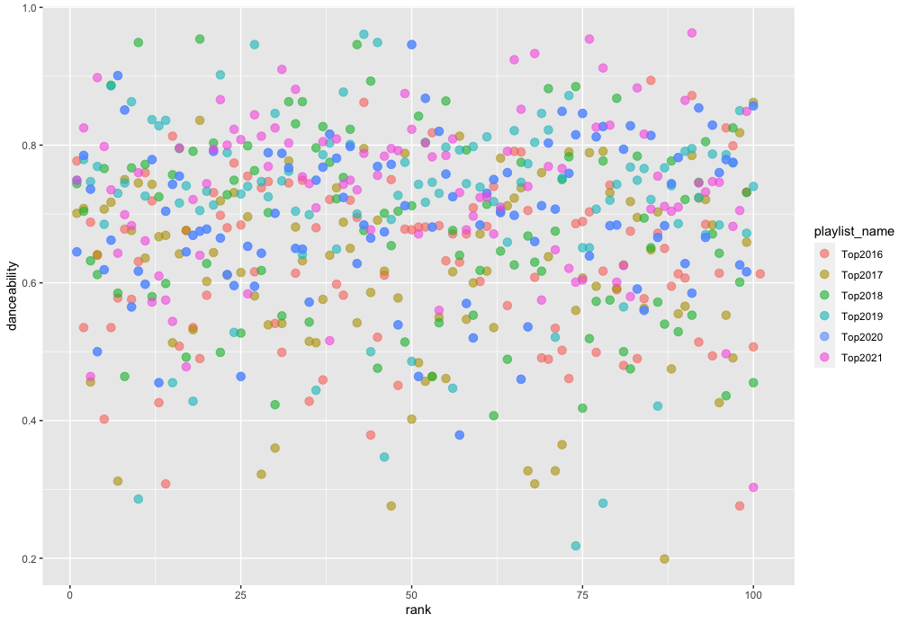
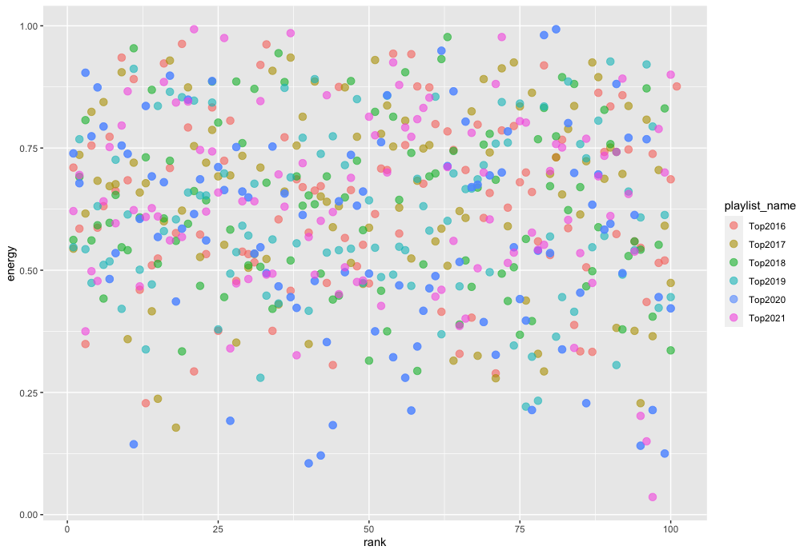
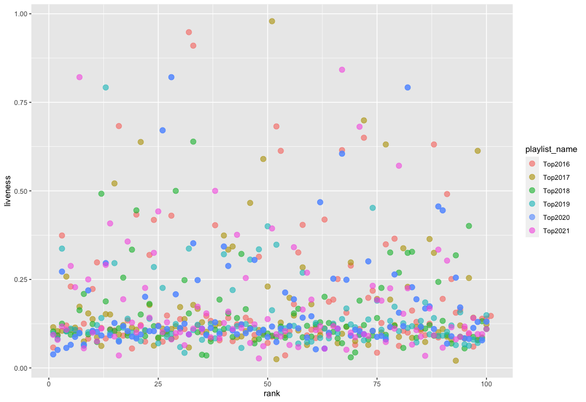
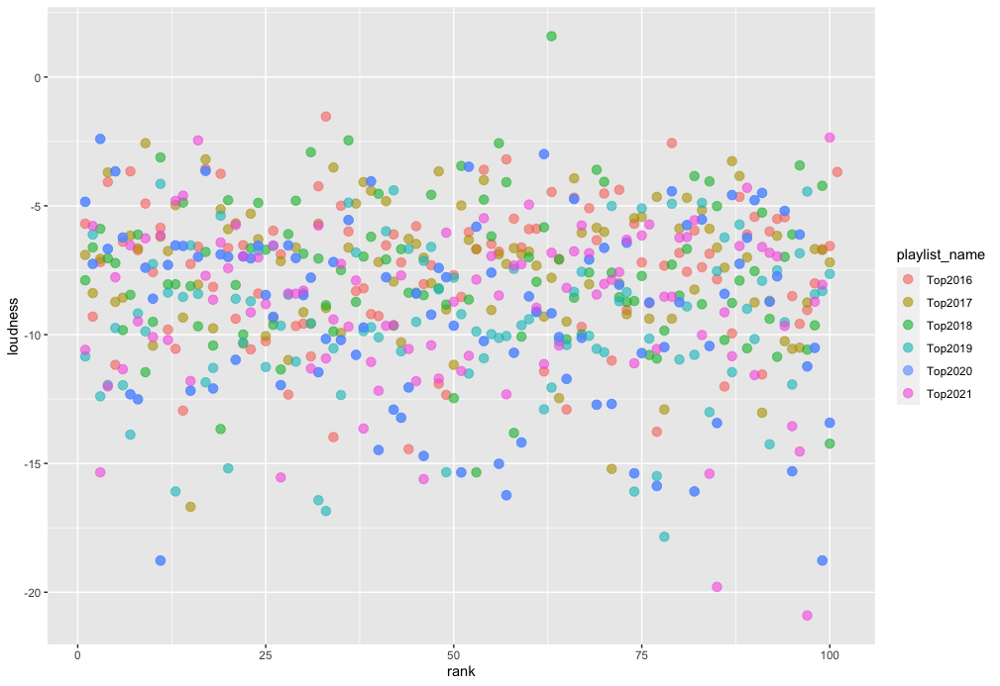
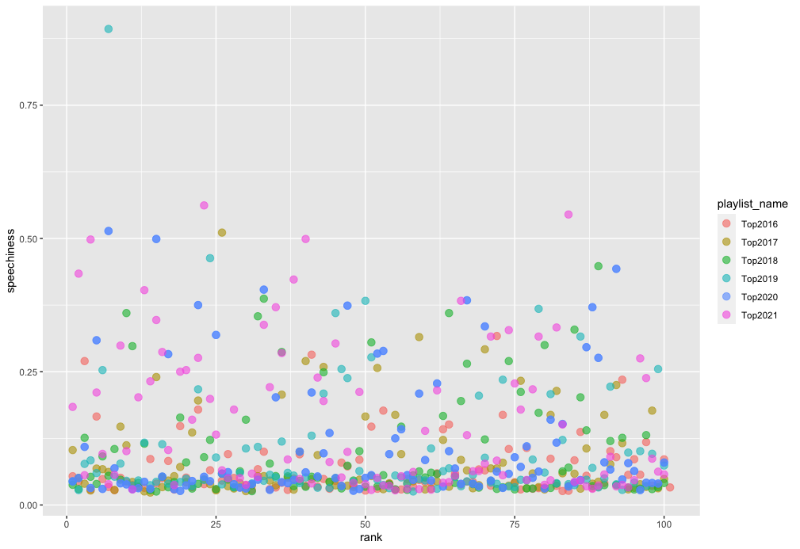

```{r setup, include=FALSE}
knitr::opts_chunk$set(echo = TRUE)
```

## The Corpus

The corpus is the dataset of music I will analyze over the coming weeks. I decided to analyse my top songs of the past years, which spotify yearly curates every year for its "Wrapped 20XX" feature. On top of these "top of the year" playlists, I decided to include the "My Time Capsule" playlist. This playlist is generated by spotify based on your taste in music and is supposed to result in a personal throwback mix. Therefore my corpus consists of:

- [YourTopSongs2021](https://open.spotify.com/playlist/79X273LI34tXLJRXNLIiIz)
- [YourTopSongs2020](https://open.spotify.com/playlist/4MMsv9uHzs4yr8YAIRMPfD)
- [YourTopSongs2019](https://open.spotify.com/playlist/6pHwUhsAgex7HmE53zulm4)
- [YourTopSongs2018](https://open.spotify.com/playlist/1mgY2xI49CWUfBpNzzidQO)
- [YourTopSongs2017](https://open.spotify.com/playlist/1xgUVZdrris3opd6rW6TSX)
- [YourTopSongs2016](https://open.spotify.com/playlist/0aiaCO6mk6bEPPDErC9oFp)
- [YourTimeCapsule](https://open.spotify.com/playlist/5hb3DGs2AGTl4jfXzM6lRF) 

## Motivation
This dataset consists of 650 songs over a span of six years. I'm interested if and how my taste and music has changed, if there are trends which could correlate with events in my life, and if I can uncover the recipe for the "Time Capsule" Playlist. How does the distribution between genres shift? Are there artists that stay consistently throughout the years, are there "rising stars"?

A strength of this dataset is that it should be expressive - I can't find the exact number right now, but as far as I remember my "minutes of listening" per year are around 50.000 minutes/year. A weakness (or maybe visible trend?) could be that over the past two years I've shifted away from listening on Spotify exclusively to using SoundCloud specifically for listening to Techno & House.

As (a-)typical songs I have selected the first and last song of the six yearly playlists:

### Tops

| Title | Artist | Year |
|-------|--------|------|
| Fernsehturm | Gossenboss mit Zett | 2021 |
| Flash | Lewis OfMan | 2020 |
| High Hopes | Rhizomatique | 2019 |
| My Life | ZHU, Tame Impala | 2018 |
| Never Learn | Brother Ali | 2017|
| Help Me Loose My Mind | Disclosure, London Grammar | 2016|

### Flops

| Title | Artist | Year |
|-------|--------|------|
| Feels Like We Only Go Backwards | Tame Impala | 2021 |
| Looking Back | goosetaf | 2020 |
| Control Myself | Leisure | 2019 |
| So Far | Olafur Arnalds, Arnor Dan | 2018 |
| Faded - Original Mix | ZHU | 2017|
|Verschwende mich | OK KID | 2016|

## Genre Evolution

First I wanted to explore the shifts in genre distribution over the years. 
Since the Spotify API doesn't provide the feature `genre` on a track level, but
only for artists, I collected the genres of the artist(s) of each song. 

Spotifys Genre Distinction is very detailed. There are over 700 distinct Genres 
for 600 songs (since songs can fit multiple genres), which makes it hard to
easily derive shifts in simple terms like "shifted from rock to pop". For this, I
have to first simplify the genres (e.g. grouping "deep house", "deep euro house",
 "classic house" etc. all under "house"). Nonetheless it's easy to see that there is
 some change between the years.


## Do Features influence Rank?

Since the playlists include a ranking of 1 - 100, I wondered if there are any features 
that show a clear influence on their ranking. I mapped all track features 
(danceability, energy, key, loudness, mode, speechiness, acousticness, 
instrumentalness, liveness, tempo, valence) against the ranking to no clear result -
it appears that there is no correlation between the ranking and the features. Some
charts below:

What these plots show are different trends: low `speechiness` and `liveness` 
in general, whereas energy and danceability are quite more varying.







