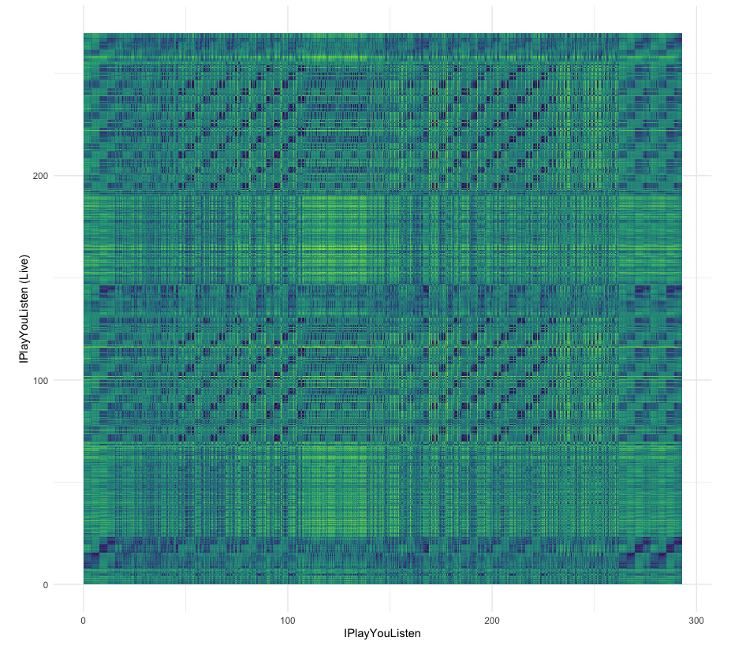

```{r setup, include=FALSE}
knitr::opts_chunk$set(echo = TRUE)
```

```{r global, include=FALSE}
# load libs for the whole dasbhoard
library(ggplot2)
library(tidyverse)
library(spotifyr)
library(compmus)
library(grid)
library(gridExtra)
load("data/Featuresv2.RData")
```

# 5 - Tempograms

## Column 1 {data-width="650"}

## Column 2 {data-width="350"}


# A Blast from the Past - Analyzing my best of the last 6 years

## Column 1 {data-width="650"}

### The Corpus

The corpus is the dataset of music I will analyze over the coming weeks. I decided to analyse my top songs of the past years, which spotify yearly curates every year for its "Wrapped 20XX" feature. On top of these "top of the year" playlists, I decided to include the "My Time Capsule" playlist. This playlist is generated by spotify based on your taste in music and is supposed to result in a personal throwback mix. Therefore my corpus consists of:

- [YourTopSongs2021](https://open.spotify.com/playlist/79X273LI34tXLJRXNLIiIz)
- [YourTopSongs2020](https://open.spotify.com/playlist/4MMsv9uHzs4yr8YAIRMPfD)
- [YourTopSongs2019](https://open.spotify.com/playlist/6pHwUhsAgex7HmE53zulm4)
- [YourTopSongs2018](https://open.spotify.com/playlist/1mgY2xI49CWUfBpNzzidQO)
- [YourTopSongs2017](https://open.spotify.com/playlist/1xgUVZdrris3opd6rW6TSX)
- [YourTopSongs2016](https://open.spotify.com/playlist/0aiaCO6mk6bEPPDErC9oFp)
- [YourTimeCapsule](https://open.spotify.com/playlist/5hb3DGs2AGTl4jfXzM6lRF)


<iframe style="border-radius:12px" src="https://open.spotify.com/embed/playlist/5hb3DGs2AGTl4jfXzM6lRF?utm_source=generator" width="100%" height="380" frameBorder="0" allowfullscreen="" allow="autoplay; clipboard-write; encrypted-media; fullscreen; picture-in-picture"></iframe>

#### Motivation
This dataset consists of 650 songs over a span of six years. I'm interested if and how my taste and music has changed, if there are trends which could correlate with events in my life, and if I can uncover the recipe for the "Time Capsule" Playlist. How does the distribution between genres shift? Are there artists that stay consistently throughout the years, are there "rising stars"?

A strength of this dataset is that it should be expressive - I can't find the exact number right now, but as far as I remember my "minutes of listening" per year are around 50.000 minutes/year. A weakness (or maybe visible trend?) could be that over the past two years I've shifted away from listening on Spotify exclusively to using SoundCloud specifically for listening to Techno & House.

## Column 2 {data-width="350"}

As (a-)typical songs I have selected the first and last song of the six yearly playlists:


#### Tops

| Title | Artist | Year |
|-------|--------|------|
| Fernsehturm | Gossenboss mit Zett | 2021 |
| Flash | Lewis OfMan | 2020 |
| High Hopes | Rhizomatique | 2019 |
| My Life | ZHU, Tame Impala | 2018 |
| Never Learn | Brother Ali | 2017|
| Help Me Loose My Mind | Disclosure, London Grammar | 2016|

#### Flops

| Title | Artist | Year |
|-------|--------|------|
| Feels Like We Only Go Backwards | Tame Impala | 2021 |
| Looking Back | goosetaf | 2020 |
| Control Myself | Leisure | 2019 |
| So Far | Olafur Arnalds, Arnor Dan | 2018 |
| Faded - Original Mix | ZHU | 2017|
|Verschwende mich | OK KID | 2016|

# 1 - Genre Evolution

## Column 1 {data-width="650"}

###

```{r echo=FALSE}
load("data/GenreEvolution.RData")
interactivePlot

```
## Column 2 {data-width="350"}

###

#### Genre Evolution

First I wanted to explore the shifts in genre distribution over the years. 
Since the Spotify API doesn't provide the feature `genre` on a track level, but
only for artists, I collected the genres of the artist(s) of each song. 

Spotifys Genre Distinction is very detailed. There are over 700 distinct Genres 
for 600 songs (since songs can fit multiple genres), which makes it hard to
easily derive shifts in simple terms like "shifted from rock to pop". For this, I
have to first simplify the genres (e.g. grouping "deep house", "deep euro house",
 "classic house" etc. all under "house"). Nonetheless it's easy to see that there is
 some change between the years.


# 1 - Do Features Influence Rank?

## Column 1 {.tabset data-width="650"}


### instrumentalness
```{r echo=FALSE}
instrumentalnessPlot
```

### acousticness
```{r echo=FALSE}
acousticnessPlot
```


### energy
```{r echo=FALSE, }
energyPlot
```

<!-- ### key -->
<!-- ```{r echo=FALSE} -->
<!-- keyPlot -->
<!-- ``` -->

<!-- ### loudness -->
<!-- ```{r echo=FALSE} -->
<!-- loudnessPlot -->
<!-- ``` -->

<!-- ### mode -->
<!-- ```{r echo=FALSE} -->
<!-- modePlot -->
<!-- ``` -->

### speechiness
```{r echo=FALSE, }
speechinessPlot
```


### tempo
```{r echo=FALSE, }
tempoPlot
```

### danceability
```{r echo=FALSE, }
danceabilityPlot
```

### liveness
```{r echo=FALSE, }
livenessPlot
```

### valence
```{r echo=FALSE, }
valencePlot
```

## Column 2 

###

Since the playlists include a ranking of 1 - 100, I wondered if there are any 
features  that show a clear influence on their ranking. I mapped all track
features (danceability, energy, key, loudness, mode, speechiness, acousticness, 
instrumentalness, liveness, tempo, valence) against their rank.

Where as some features do not appear to correlate with the rank 
(`danceability`, `liveness`, `valence`), others clearly do: 

`instrumentalness` lost its popularity over time. Still being on the rise in 2016,
it flattened out over the years and started declining in 2020 and 2021.

`acousticness` also lost on importance in the past two years, whereas `speechiness` 
made a comeback in 2021 - I would attribute this to a higher proportion of hip-hop
or rap songs.

# 2 - Live from Odesza - A chroma comparison

## Column 1 {data-width="650"}

### DTW plot



## Column 2 {data-width="350"}

### Live vs. Studio


For a chromagram analysis I picked the song "IPlayYouListen" from ODESZA. A live performance of this piece is part of my corpus. I compared the live version (4:29) to the studio recording (4:42).

In the plot we can see that the two recordings do not align perfectly. Instead, there are "blocks" of alignment.

# Best of Chroma 
## Column 1 {data-width="650"}

###

```{r out.width="100%", fig.height=2, echo=FALSE}
load("data/bestofChromas.RData")

drawPlot <- function(year) {
  ggplot(unnest(bestOfChromas[year, "chromas"]),
     aes(
       x = start + duration / 2,
       width = duration,
       y = pitch_class,
       fill = value
     )
) +
geom_tile() +
labs(x = "Time (s)", y = NULL, fill = "Magnitude") +
theme_minimal() +
theme(legend.position = "none") +
scale_fill_viridis_c() +
ggtitle(bestOfChromas[year, "years"])
}

drawPlot(1)
drawPlot(2)
drawPlot(3)
drawPlot(4)
drawPlot(5)
drawPlot(6)


```

## Column 2 {data-width="350"}

###

Let's have a look at the chromagrams of the top hits of each year. You can listen to the songs with the player below.

Typical for hip-hop songs, *Never Learn - Brother Ali (2017)* and *Fernsehturm - Gossenboss mit Zett (2021)* show a very regular pattern throughout the whole song, since there is no recurring chorus or similar. 

In *Flash - Lewis OfMan (2020)* you can very clearly see the alternating G and Gminor, which one can hear in the rhythm of the song as well.

*ToDo 2016, 2018, 2019*

*Help Me Loose My Mind - Disclore, London Grammar (2016)*

*My Life - ZHU, Tame Impala (2018)*

*High Hopes - Rhizomatique (2019)*

<iframe style="border-radius:12px" src="https://open.spotify.com/embed/playlist/6U9T757W62BA5W9T9G5lQh?utm_source=generator" width="100%" height="380" frameBorder="0" allowfullscreen="" allow="autoplay; clipboard-write; encrypted-media; fullscreen; picture-in-picture"></iframe>

# 3 - *Flashy* Self Similarity Matrices 

## Column 1 {data-width="650"}

### Self-Similarity Matrices

```{r echo=FALSE}
load("data/flashSSM.RData")
grid.arrange(pitchesSSMFlashPlotSections, timbreSSMFlashPlotSections, pitchesSSMFlashPlotBeats, timbreSSMFlashPlotBeats, ncol = 2, nrow = 2,top = "Flash - Lewis OfMan")

```

## Column 2 {data-width="350"}

### Flash - Lewis OfMan

For an in-depth self-similarity analysis I selected my top song of 2020. Looking at the pitches in a "coarse" granularity (looking at segments), you can already make out some highlights like lines, but only when increasing the level of detail to beats, we start to see a very thorough checkerboard pattern throughout the whole song. You can also hear this pattern-change in the beat throughout the song.

The horizontal and vertical line at the 60s mark resembles the sudden stop of the synthesizer (and only drums playing). Again, at 2:20m (or 140s), the synthesizer fades out almost completely, only leaving cowbells and drums - this time it takes a little more time for the synth to come back.

The timbre plot doesn't show as clear results as the pitches - there's a small checker board pattern near the center, but not much else to see here.


<iframe style="border-radius:12px" src="https://open.spotify.com/embed/track/52d8baQxvV3AkHcAyXCkkO?utm_source=generator" width="100%" height="380" frameBorder="0" allowfullscreen="" allow="autoplay; clipboard-write; encrypted-media; fullscreen; picture-in-picture"></iframe>


# 4 - Standard Deviation 

## Column 1 {data-width="650"}

### 
```{r echo=FALSE}
load("data/sdPlot.RData")
getSdPlot()
```

## Column 2 {data-width="350"}

###

Comparing time campsule, best of 2021, and best of 2016.
TODO: go into detail


# Conclusion

to be done