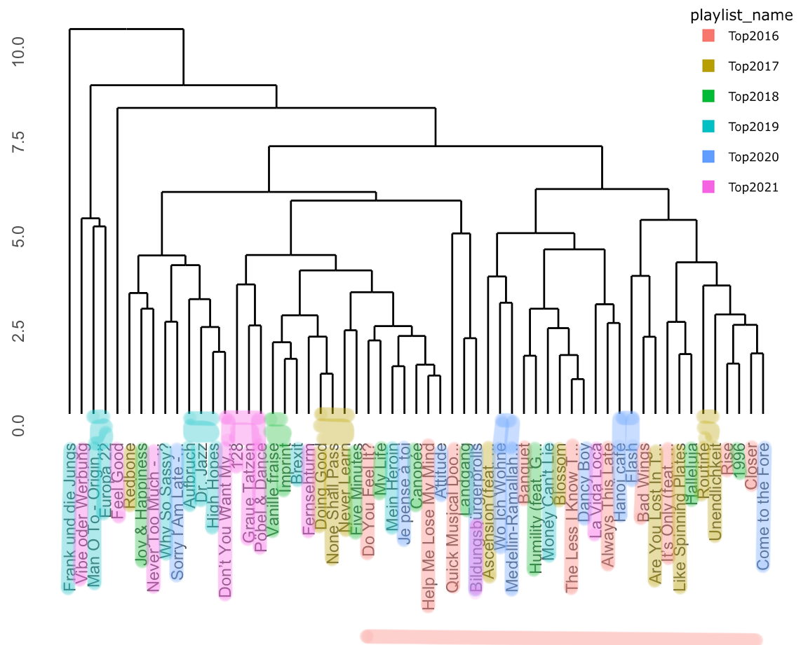

```{r setup, include=FALSE}
knitr::opts_chunk$set(echo = TRUE)
```

```{r global, include=FALSE}
# load libs for the whole dasbhoard
library(ggplot2)
library(tidyverse)
library(spotifyr)
library(compmus)
library(grid)
library(gridExtra)
load("data/01_Featuresv2.RData")
```


# A Blast from the Past - Analyzing my best of the last 6 years

## Column 1 {data-width="650"}

### The Corpus

The corpus is the dataset of music I will analyze over the coming weeks. I decided to analyse my top songs of the past years, which spotify yearly curates every year for its "Wrapped 20XX" feature. On top of these "top of the year" playlists, I decided to include the "My Time Capsule" playlist. This playlist is generated by spotify based on your taste in music and is supposed to result in a personal throwback mix. All of my top songs from 2016 to 2021 as well as the time capsule can be found here:

<iframe style="border-radius:12px" src="https://open.spotify.com/embed/playlist/2zVji32K3ZzmVKHl40CIYA?utm_source=generator" width="100%" height="80" frameBorder="0" allowfullscreen="" allow="autoplay; clipboard-write; encrypted-media; fullscreen; picture-in-picture"></iframe>

#### Motivation
This dataset consists of close to 600 songs over a span of six years. I'm interested if and how my taste and music has changed, if there are trends which could correlate with events in my life, and if I can uncover the recipe for the "Time Capsule" Playlist. How does the distribution between genres shift? Are there artists that stay consistently throughout the years, are there "rising stars"?

A strength of this dataset is that it should be expressive - I can't find the exact number right now, but as far as I remember my "minutes of listening" per year are around 50.000 minutes/year. A weakness (or maybe visible trend?) could be that over the past two years I've shifted away from listening on Spotify exclusively to using SoundCloud specifically for listening to Techno & House.

On the right you can see typical (Tops) and atypical (Flops) samples of the corpus.


### Genre Evolution

```{r echo=FALSE}
load("data/00_GenreEvolution.RData")
interactivePlot

```


## Column 2 {data-width="350"}

### The Corpus


| Title | Artist | Year |
|:-------|:--------|------:|
| **Tops** |
| Fernsehturm | Gossenboss mit Zett | 2021 |
| Flash | Lewis OfMan | 2020 |
| High Hopes | Rhizomatique | 2019 |
| My Life | ZHU, Tame Impala | 2018 |
| Never Learn | Brother Ali | 2017|
| Help Me Loose My Mind | Disclosure, London Grammar | 2016|
| **Flops** |
| Feels Like We Only Go Backwards | Tame Impala | 2021 |
| Looking Back | goosetaf | 2020 |
| Control Myself | Leisure | 2019 |
| So Far | Olafur Arnalds, Arnor Dan | 2018 |
| Faded - Original Mix | ZHU | 2017|
|Verschwende mich | OK KID | 2016|

### Genre Evolution

Let's have a look at the plot on the left. I wanted to explore the shifts 
in genre distribution over the years. 
Since the Spotify API doesn't provide the feature `genre` on a track level, but
only for artists, I collected the genres of the artist(s) of each song. 

Spotifys Genre Distinction is very detailed. There are over 700 distinct Genres 
for the close to 600 songs in my corpus, since songs can fit multiple genres.
This makes it a bit hard to easily derive shifts in simple terms like 
"shifted from rock to pop". For this, I would have to first simplify the genres
(e.g. grouping "deep house", "deep euro house", "classic house" etc. all under "house"). 
Nonetheless it's easy to see that there is some change between the years. By hovering
the graph you can explore the genres - there are too many to fit them into a 
legend. When you look at the most right bar, the "timeCapsule" playlist, you can see
that it does not continue with the trend of the bars, but rather resembles 2017 or 2018,
showing that it apparently is orientated on previous years.


# 1 - Do Features Influence Rank?

## Column 1 {.tabset data-width="650"}


### instrumentalness
```{r echo=FALSE}
instrumentalnessPlot
```

### acousticness
```{r echo=FALSE}
acousticnessPlot
```

### speechiness
```{r echo=FALSE, }
speechinessPlot
```

### energy
```{r echo=FALSE, }
energyPlot
```

<!-- ### key -->
<!-- ```{r echo=FALSE} -->
<!-- keyPlot -->
<!-- ``` -->

<!-- ### loudness -->
<!-- ```{r echo=FALSE} -->
<!-- loudnessPlot -->
<!-- ``` -->

<!-- ### mode -->
<!-- ```{r echo=FALSE} -->
<!-- modePlot -->
<!-- ``` -->


### tempo
```{r echo=FALSE, }
tempoPlot
```

### danceability
```{r echo=FALSE, }
danceabilityPlot
```

### liveness
```{r echo=FALSE, }
livenessPlot
```

### valence
```{r echo=FALSE, }
valencePlot
```

## Column 2

### Comparing the changes in feature distribution over time

Since the playlists include a ranking of 1 - 100, I wondered if there are any
features  that show a clear influence on their ranking. I mapped all track
features (danceability, energy, key, loudness, mode, speechiness, acousticness,
instrumentalness, liveness, tempo, valence) against their rank.

Where as some features do not appear to correlate with the rank
(`danceability`, `liveness`, `valence`), others clearly do:

`instrumentalness` lost its popularity over time. Still being on the rise in 2016,
it flattened out over the years and started declining in 2020 and 2021.

`acousticness` also lost on importance in the past two years, whereas `speechiness`
made a comeback in 2021 - I would attribute this to a higher proportion of hip-hop
or rap songs.

It didn't make sense to plot the timeCapsule playlist into these comparisons: First
it only consists of 50 songs instead of a 100, and as far as I can tell they are not
ordered. Additionally I noticed that the playlist is ever changing, and spotify adds
and removes songs over time.

# 2 - Live from Odesza - A chroma comparison

## Column 1 {data-width="650" .tabset}

### Dynamic Time Warping

```{r echo=FALSE}
load("data/02_dtw.RData")
odeszaDTW
```

### Best of Chroma

```{r out.width="100%", fig.height=2, echo=FALSE}
load("data/02_bestofChromas.RData")

drawPlot <- function(year) {
  ggplot(unnest(bestOfChromas[year, "chromas"]),
     aes(
       x = start + duration / 2,
       width = duration,
       y = pitch_class,
       fill = value
     )
) +
geom_tile() +
labs(x = "Time (s)", y = NULL, fill = "Magnitude") +
theme_minimal() +
theme(legend.position = "none") +
scale_fill_viridis_c() +
ggtitle(bestOfChromas[year, "years"])
}

drawPlot(1)
drawPlot(2)
drawPlot(3)
drawPlot(4)
drawPlot(5)
drawPlot(6)

```

## Column 2 {data-width="350"}

### Chroma Analysis

#### Live vs. Studio

For a chromagram analysis I picked the song "IPlayYouListen" from ODESZA. A live performance of this piece is part of my corpus. I compared the live version (4:29) to the studio recording (4:42).

In the plot we can see that the two recordings do not align perfectly. Instead, there are "blocks" of alignment.

<iframe style="border-radius:12px" src="https://open.spotify.com/embed/track/4X0hePXqBlFkOZ9WWp5W1e?utm_source=generator" width="100%" height="80" frameBorder="0" allowfullscreen="" allow="autoplay; clipboard-write; encrypted-media; fullscreen; picture-in-picture"></iframe>

<iframe style="border-radius:12px" src="https://open.spotify.com/embed/track/3xhR3mClWXydDCByJxnOwY?utm_source=generator" width="100%" height="80" frameBorder="0" allowfullscreen="" allow="autoplay; clipboard-write; encrypted-media; fullscreen; picture-in-picture"></iframe>

#### Best of Chroma

Let's also have a look at the chromagrams of the top hits of each year. You can listen to the songs with the player below.

Typical for hip-hop songs, *Never Learn - Brother Ali (2017)* and *Fernsehturm - Gossenboss mit Zett (2021)* show a very regular pattern throughout the whole song, since there is no recurring chorus or similar.

In *Flash - Lewis OfMan (2020)* you can very clearly see the alternating G and Gminor, which one can hear in the rhythm of the song as well.

It is harder to make out patterns in the other songs. What is clearly visible in *Help Me Loose My Mind - Disclore, London Grammar (2016)* are the pauses of the beat before the chorus for about 10 seconds from 0:40 on and 2:00 on.

I wasn't able to discover clear patterns for 2018 and 2019 (*My Life - ZHU, Tame Impala (2018)*,
*High Hopes - Rhizomatique (2019)*)

<iframe style="border-radius:12px" src="https://open.spotify.com/embed/playlist/6U9T757W62BA5W9T9G5lQh?utm_source=generator" width="100%" height="380" frameBorder="0" allowfullscreen="" allow="autoplay; clipboard-write; encrypted-media; fullscreen; picture-in-picture"></iframe>


# 3 - *Flashy* Self Similarity Matrices

## Column 1 {data-width="650"}

### Self-Similarity Matrices

```{r echo=FALSE}
load("data/03_flashSSM.RData")
grid.arrange(pitchesSSMFlashPlotSections, timbreSSMFlashPlotSections, pitchesSSMFlashPlotBeats, timbreSSMFlashPlotBeats, ncol = 2, nrow = 2,top = "Flash - Lewis OfMan")

```

## Column 2 {data-width="350"}

### Flash - Lewis OfMan

For an in-depth self-similarity analysis I selected my top song of 2020. Looking at the pitches in a "coarse" granularity (looking at segments), you can already make out some highlights like lines, but only when increasing the level of detail to beats, we start to see a very thorough checkerboard pattern throughout the whole song. You can also hear this pattern-change in the beat throughout the song.

The horizontal and vertical line at the 60s mark resembles the sudden stop of the synthesizer (and only drums playing). Again, at 2:20m (or 140s), the synthesizer fades out almost completely, only leaving cowbells and drums - this time it takes a little more time for the synth to come back.

The plot doesn't show as clear results as the pitches - there's a small checker board pattern near the center, but not much else to see here.


<iframe style="border-radius:12px" src="https://open.spotify.com/embed/track/52d8baQxvV3AkHcAyXCkkO?utm_source=generator" width="100%" height="380" frameBorder="0" allowfullscreen="" allow="autoplay; clipboard-write; encrypted-media; fullscreen; picture-in-picture"></iframe>


# 4 - Track Feature Statistics

## Column 1 {data-width="650"}

###
```{r echo=FALSE}
load("data/04_sdPlot.RData")
getSdPlot(test)
```

## Column 2 {data-width="350"}

###

Let's see how my tempo preferences have changed from 2016 to 2021, and how these
years compare to the timecapsule.

I've split the plot into three sub plots:

1. 2016 vs. 2021

2. 2016 vs. Timecapsule

3. 2021 vs. Timecapsule

In the first plot we can see that there is indeed difference between the two plots,
although they still overlap a loud. As somewhat expected, it looks like the 2016
playlist matches the timecapsule better than the 2021 does. 2021 has a few more
outlier regarding the y-axis over the whole bandwith of mean tempo. 2016 has an
interesting cluster of songs at ~150bpm.


# 5 - Tempo Tempo Tempoooo!

## Column 1 {data-width="650" .tabset}

### Quick Musical Doodles


```{r echo=FALSE}
load("data/05_tempoGrams.RData")
grid.arrange(tempoGram, cyclicTempoGram)

```

### BPMs throughout the years
```{r echo=FALSE}
load("data/05_tempoGrams.RData")
bpmHisto
```

## Column 2 {data-width="350"}

### Beat Tracking

BPMs can turn into false friends quickly. Spotify claims that the song "Quick Musical
Doodles" has a BPM of 170 - sounds fast, right? Take a listen and see if you agree.

<iframe style="border-radius:12px" src="https://open.spotify.com/embed/track/7tZdkPtebOG29TzPPHlsem?utm_source=generator" width="100%" height="80" frameBorder="0" allowfullscreen="" allow="autoplay; clipboard-write; encrypted-media; fullscreen; picture-in-picture"></iframe>

Looking at the tempogram at top we can see where the value comes from.
Spotify estimates the tempo to be either 170bpm or even higher, around 340bpm, which
would be insane. Looking at the Cyclic tempogram below, we get a more accurate reading:
BPM of 85. That sounds more reasonable.

#### Favorite beats

On the second tab there's a histogram of the tempo distribution per year. The years
2016 to 2019 we can see the somewhat expected peak around 120bpm. But in the more recent
years the distribution has evened out more, and a second peak around 94 bpm has shown up.

# 6 - Clustering

## Column 1 {data-width="650" .tabset}

### Complete Clustering

```{r echo=FALSE}
load("data/06_dendrogram.RData")
topTenDendroComplete

```


### Average Clustering

```{r echo=FALSE}
load("data/06_dendrogram.RData")
topTenDendroAverage

```

### Colorized - Playlist Clusters




### Heatmap

```{r echo=FALSE}
load("data/06_dendrogram.RData")
topTenHeatmap

```

## Column 2 {data-width="350"}

### Clustering the top tens

For the clustering, I selected the top ten song of each year, resulting in 59 (
one duplicate) songs. I wondered if the clusters would be obvious in a sense of
genre or similar. For the clustering I used track level features.

I wondered if the clustering would naturally recreate the playlist structures, and
if you look at the tab "Colorized - Playlist Clusters", you can see that it did to some
extend! It often places songs from the same playlist next to each other and matches
them on the first or second level.

Additionally you can see that the songs from 2016 are only on the right half of the
dendrogram, whereas all other playlists are spread all over.


What I found to be interesting that average and complete clustering turn out really
similar results - both fail to integrate the same five songs into clusters and
attach at them in the end, and it appears that they both cluster the same songs together.


# Conclusion

## Column 1

### Results

#### Personal Feedback

Coming from a computer science background with a specialisation in data visualisation,
I really enjoyed this project. It gave me an opportunity to apply skills to a personal
field of interest, which is the music I'm listening to on a daily basis and have been
for the past few years. I think it's really cool that spotify exposes so much of the data
which makes the ingredients for their personalised and themed playlists. I would've never
guessed on which features (like timbre or chroma) they are based.

#### Findings

My key finds are...

- I'm listening to other genres than I did previously
- The music I'm listening to tends to be slower now
- My taste in features like `instrumentalness`, `acousticness` and `speechniness` has also changed
- Some analysis are more fitted to a smaller scale and did not really translate to the whole corpus
- I did not uncover the complete recipe for the time capsule playlist


